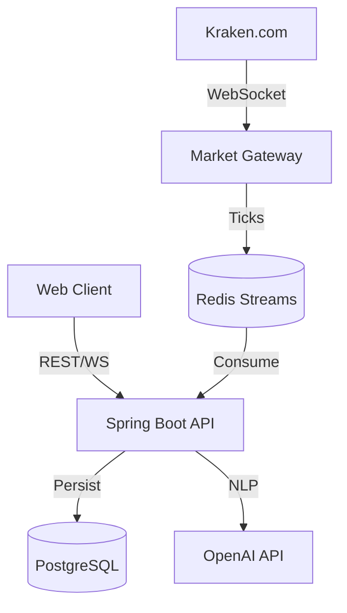

# CryptoPlatform

> AI-powered crypto trading platform with real-time market data, paper trading, and natural language trade execution.

## 🚀 Quick Start

```bash
docker compose up --build
```

**Access the application:**
- API: http://localhost:8080
- Swagger Docs: http://localhost:8080/swagger-ui.html

## ✨ Features

- **AI Trading Agent** - Execute trades using natural language commands via OpenAI integration
- **Real-Time Market Data** - Sub-millisecond updates via Redis Streams and WebSockets
- **Paper & Live Trading** - Switch seamlessly between simulation and live Kraken trading
- **JWT Authentication** - Secure user authentication and authorization
- **Portfolio Tracking** - Real-time holdings evaluation and P&L tracking

## 🛠️ Tech Stack

**Backend:** Java 21, Spring Boot 3.4, WebFlux  
**Data:** PostgreSQL, Redis Streams  
**External APIs:** Kraken WebSocket, OpenAI  
**Infrastructure:** Docker, Docker Compose

See [TECH_STACK.md](TECH_STACK.md) for detailed architecture and roadmap.

## 🏗️ Architecture



## ⚙️ Configuration

Create a `.env` file with the following (required for AI and live trading):

```env
AI_API_KEY=your_openai_api_key
KRAKEN_API_KEY=your_kraken_api_key
KRAKEN_API_SECRET=your_kraken_api_secret
```

## 📋 API Examples

**Sign Up**
```bash
curl -X POST http://localhost:8080/auth/signup \
  -H "Content-Type: application/json" \
  -d '{"email":"user@test.com", "password":"password"}'
```

**Login**
```bash
curl -X POST http://localhost:8080/auth/login \
  -H "Content-Type: application/json" \
  -d '{"email":"user@test.com", "password":"password"}'
```

**AI Trade Command**
```bash
curl -X POST http://localhost:8080/ai/command \
  -H "Authorization: Bearer <YOUR_TOKEN>" \
  -H "Content-Type: application/json" \
  -d '{"command": "Buy $500 of Ethereum"}'
```

**Real-Time Prices**  
Visit http://localhost:8080/test-ws.html for WebSocket demo.

## � License

MIT
